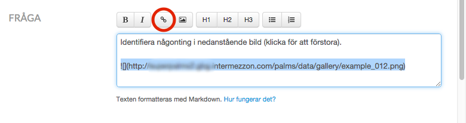
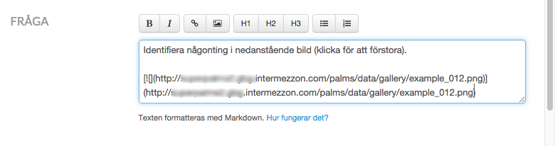

Lägg till klickbar bild i fråga eller annan text
===

1. Ladda upp en bild 
  1. Bild uppladdad 
2. Markera bildens kod och klicka på Lägg till länk-knappen 
  1. Länkens kod är tillagd 
3. Markera adressen (utan `http://`!) och kopiera 
4. Klistra in adressen efter `http://` 

