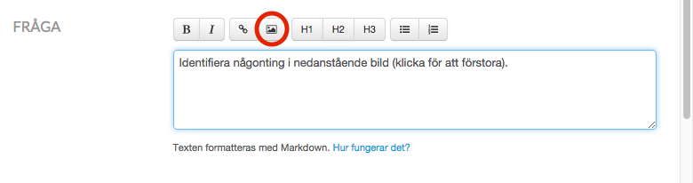
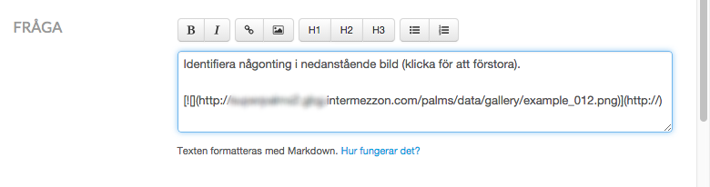
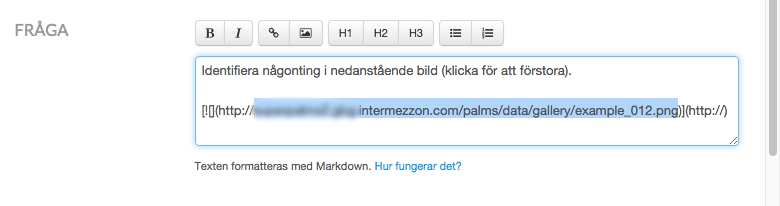

Lägg till klickbar bild i fråga eller annan text
===

I exemplet kommer vi redigera texten i en fråga, men det fungerar på samma 
sätt på andra ställen där man kan redigera text.

Gå till texten du vill redigera, och börja med att ladda upp en bild.  

Därefter kommer det se ut ungefär såhär.  

Markera hela bildens kod (från `!` till `)`) och klicka på `Lägg till 
länk`-knappen.  

Därefter kommer det ut ungefär såhär.  

Markera och kopiera bildens adress (utan `http://`!).  

Klistra in adressen efter `http://` i slutet av raden.  

